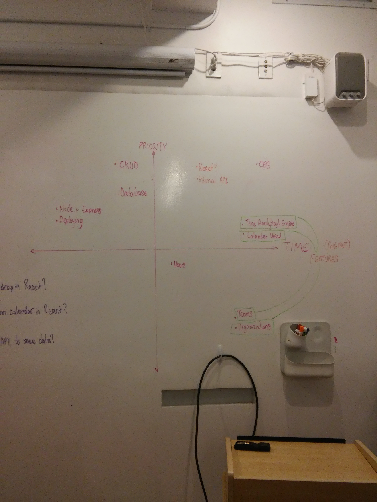
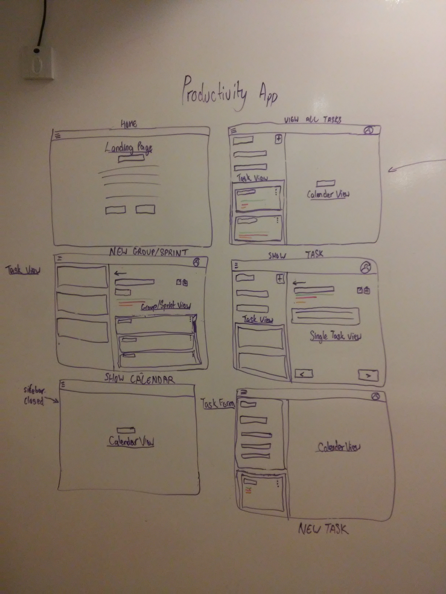
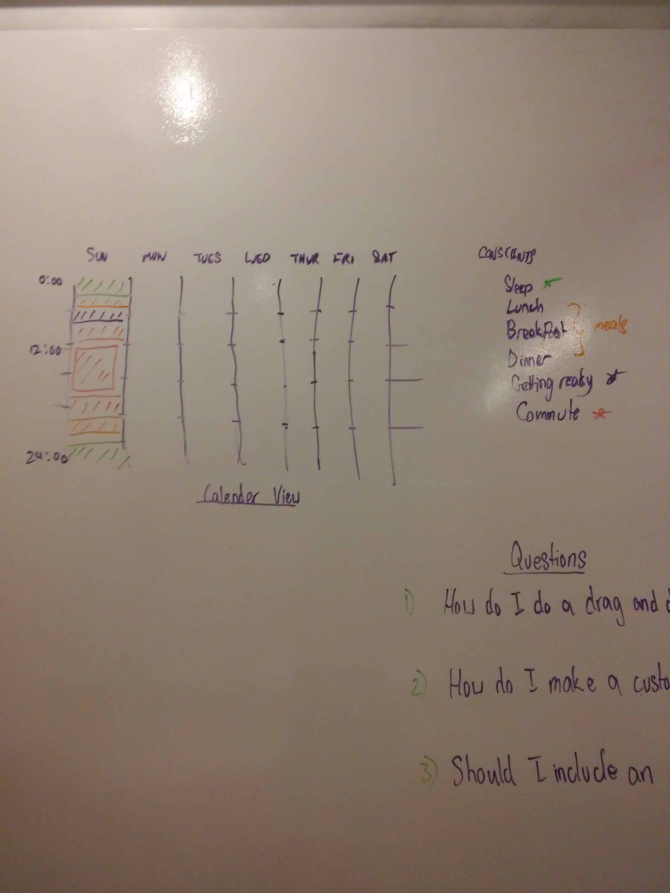

# Project Overview
Fight off your overwelming load of things to do with OnTrack. OnTrack is a one stop solution for all your organizing needs. Our app will intelligently schedule users' task do be done in the most efficient way possible; creating more time for you to enjoy life.

Quick Links:
- [Project Description](#project-description)
- [Installing the App](#installing-the-app)
- [MVP](#mvp)
- [Post MVP](#post-mvp)
- [Priority Matrix](#priority-matrix)
- [Schedule for Completion](#schedule-for-completion)
- [User Stories](#user-stories)
- [OnTrack Wireframes](#wireframes)
- [Code Snippet from Project](#code-snippet-from-ontrack)


## Installing the App
### Prerequisites:
>node: `>=v8.5.0`
>
>npm: `>=5.3.0`
>
>Must have a postgresSQL database installed and running on your machine.

First, clone this repository unto your machine.

Run `npm install` to install the project's dependencies. Change directory into client and run `npm install` as well.

Run `npm run setup` which will create and popluate a postgres database.

After, run `npm run start` to start the server.


<br>
<hr>
<br>

### MVP
The main purpose of the OnTrack app is to present a solution to users who possess a overhelming load of tasks to do, or to aid users who are just looking to organize their tasks efficiently. Taking these requirements into consideration, the main features that were focused on was the ablitity for users to create their own tasks and use the app to view and organize their tasks. The calendar view was also a main priority as this was the main feature of the applciation, that is to re-organize the user's created tasks into the most efficient way to get it done. Due to the time constraints however, the most efficient way was determined by sorting each tasks based on a user assigned prioprity to each task.


### Post MVP
The primary features outside of those included in the MVP would be focused on the main purpose of the app, that is to help users organize their lives. Therefore, the app needs to be easy to use, interact with, and have a low entry level to attract new users to use the app. Taking these requirements into consideration, the next features to include would be:

- Allowing users to intuitively drag and drop tasks throughout the app.
- Color coding teach task to appriopately represent that task's attributes.
- Allow users to specific more attributes on a task to improve the calender view's sorting results.
- Refactor the re-sorting alogrithm to be more intelligent (possibly add a machine learning solution)

### Priority Matrix



### Schedule for Completion
Tasks | Priority | Date | Estimated time | Time Invested
--- | --- | --- | --- | ---
Creating Database              | H | 10/10 | 12hrs | 2hrs
Setting up Node+Express        | H | 10/11 | 4hrs  | 4hrs
Adding authentication          | H | 10/11 | 8hrs  | 2hrs
Setting up React App           | H | 10/11 | 4hrs  | 2hrs
Structuring React App          | H | 10/11 | 2hrs  | 3hrs
Building React UI Components   | H | 10/12 | 4hrs  | 4hrs
Styling each Component         | H | everyday | 12hrs | 6hrs
Calendar View                  | H | 10/13 | 12hrs | 6hrs
Time Analytical Engine         | H | 10/13 | 24hrs | 2hrs (shallow implementation)
Deploying App                  | H | 10/14 | 2hrs  | 2hrs
Editing Readme                 | H | everyday | 6hrs | 4hrs 

### User Stories

1. As a user, I can add tasks to my task list.

2. As a user, I can group my tasks into groups or more specifically, sprints.

3. As a user, I can view a calendar showing all of tasks to be done that have been intelligently re-ordered for maximum efficiency.

### Wireframes
Home Page Wireframe



Calendar View




### Code Snippet from OnTrack

#### The Core Implementation of the 'Time Analyical Engine'
This is the alogrithm that decides how the tasks as of right now, are re-ordered. Due to time constraints, the ambitiions for the engine was scaled down to using a user defined priority level.

```javascript
const constants = [
  [
    { name: 'sleep', start: 0, end: 2, attributes: { estimate_time: 2} },
    { name: 'sleep', start: 21, end: 23, attributes: { estimate_time: 2}},
  ],
  [
    { name: 'reading', start: 15, end: 17, attributes: { estimate_time: 2}},
  ],
];

const TimeAnalyticalEngine = {
  populate(tasks) {
    // go through each day, move group into each day.
    let days = [];

    const daysWithConstants = utilties.days.map(utilties.populateWithConstants(constants));
    days = daysWithConstants.map(utilties.populate(
        utilties.sort(tasks, 'attributes.priority_lvl', 'DESC')
    ));
    console.log(days);
    return days;
  }
};
```
